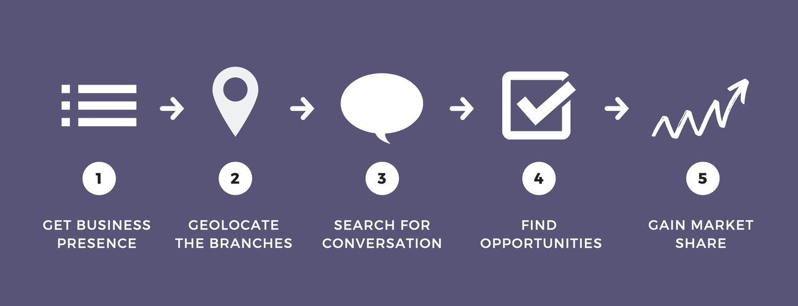

> Measure local reputation of global banking

**HearHere** analyzes the opinion generated by banks around their branches to improve their acceptance in each community.




## About the project

### Requeriments

Install the needed libraries for the project:

```
pip3 install requests
pip3 install pandas
pip3 install bs4
pip3 install googlemaps
```

### Data sources

Locations extracted from:

- [BBVA - Branch and Cashier Locator](https://www.bbva.es/general/localizador-oficinas-cajeros/index.jsp) - BBVA branches locations

Connected APIs:

- [Google Geocoding API](https://developers.google.com/maps/documentation/geocoding/start) - Full addresses and coordinates

### Project structure

Files:

- **main.ipynb**: Jupyter file with HH queries setup and visualization
- **scrapers.py**: Download data from web
- **config.py**: Project paths configuration
- api_keys.py*

Folders:

- **data**: Data from scraping
- **images**

### Road map (next steps)

- Improve the amount and quality of information retrieved with APIs, specially when Geocoding
- Add new banks so that they can be compared with each other
- Improve code efficiency
- Expand the tool to other sectors